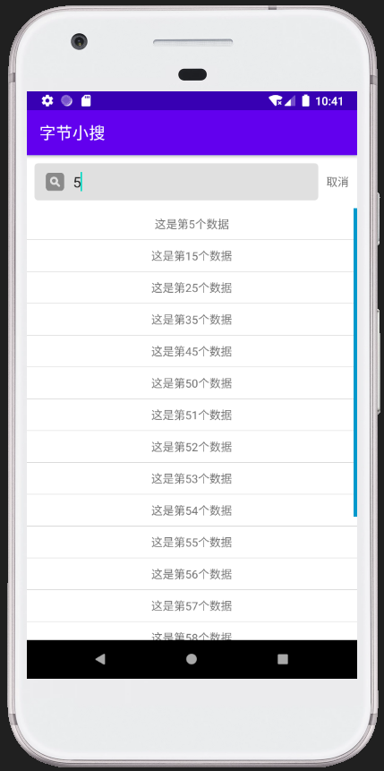
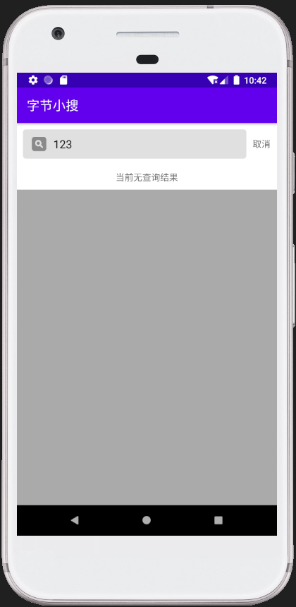

# ByteDance_Android_Homework
  字节跳动安卓开发课程作业
  
  **chapter1第一次作业 (2020.11.05)：**
  
 + 作业任务：
  
      完成Helloworld功能

  **chapter2第二次作业 (2020.11.05)：**
  
 + 作业任务：
 
      设计一个搜索栏控件并实现简单查询功能
    
 + 加入小改进：
 1. 对RecyclerView的若干搜索项之间添加分隔符，使搜索项更加条理清晰
 2. 当搜索不到结果时显示"当前无查询结果"给予用户反馈
 3. 在RecyclerView右侧加入滑动条
 4. 对搜索框边缘进行圆角过渡处理
 
 
 
 

**chapter3第三次作业 (2020.11.22)：**
  
 + 作业任务：
 
      设计动画实现scale、fade变化
    
 + （由于课业较多，暂时只做了ex2）
 
 **chapter4第四次作业 (2020.11.22)：**
  
 + 作业任务：
 
      设计一个钟表功能，需绘制表盘、控制时钟走时。

 
 

